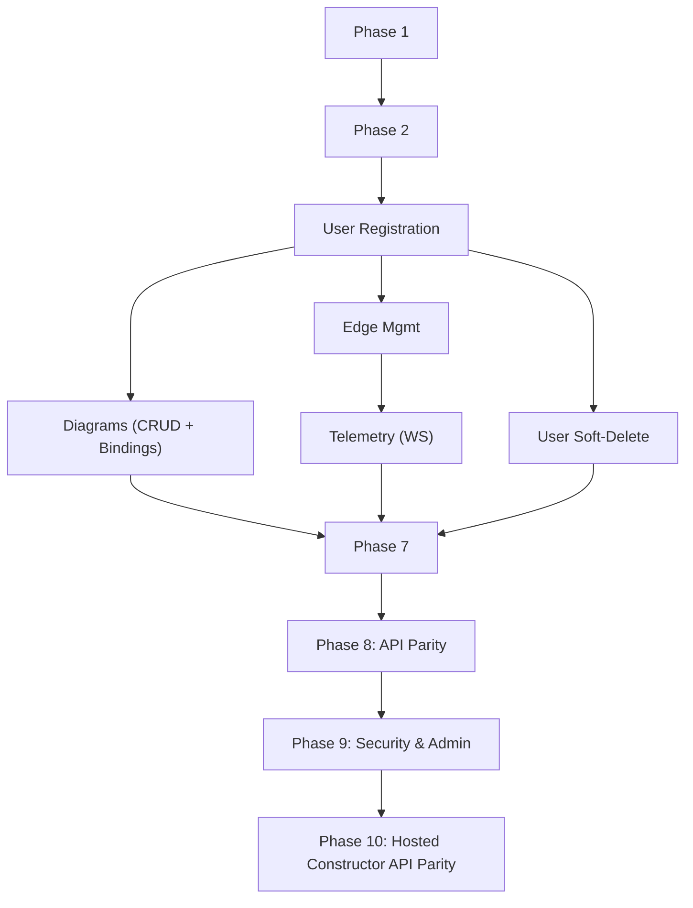

# Implementation Tasks: Cloud Server Core Platform

## 1. Setup Phase

- [X] T001 Initialize Node.js TypeScript project in `cloud_server/`
- [X] T002 [P] Configure `tsconfig.json` for strict type checking
- [X] T003 [P] Set up `package.json` with dependencies (Express.js, Socket.IO, Mongoose, JsonWebToken, Bcrypt, dotenv) and devDependencies (Vitest, supertest, typescript, ts-node, etc.)
- [X] T004 Build basic Express server entrypoint (`cloud_server/src/app.ts`)
- [X] T005 Setup `.env` config loader (`cloud_server/src/config/env.ts`)

## 2. Foundational Phase

- [X] T006 Configure MongoDB connection utility with Mongoose (`cloud_server/src/database/mongoose.ts`)
- [X] T007 [P] Create centralized error handling middleware (`cloud_server/src/api/middlewares/error.middleware.ts`)
- [X] T008 [P] Initialize Socket.IO instance attached to server (`cloud_server/src/socket/io.ts`)

## 3. User Story 1: User Registration and Onboarding [US1]

**Goal**: Support user login, token generation (JWT), and system authentication.

- [X] T009 [US1] Create Mongoose User Model with validation (`cloud_server/src/models/User.ts`)
- [X] T010 [US1] Create Auth Service with bcrypt hashing and JWT generation (`cloud_server/src/services/auth.service.ts`)
- [X] T011 [US1] Implement Auth Controllers for `/auth/register` and `/auth/login` (`cloud_server/src/api/auth.controller.ts`)
- [X] T012 [US1] Add auth routes to main Express router (`cloud_server/src/api/routes.ts`)
- [X] T013 [P] [US1] Write unit tests for `/auth/login` and `/auth/register` endpoints (`cloud_server/tests/unit/auth.test.ts`)
- [X] T014 [US1] Create JWT Auth Middleware to protect routes (`cloud_server/src/api/middlewares/auth.middleware.ts`)
- [X] T015 [US1] Create Admin Role Authorization Middleware (`cloud_server/src/api/middlewares/role.middleware.ts`)

## 4. User Story 2: Creating and Saving Diagrams [US2]

**Goal**: Enable users to save, load and soft-version frontend mnemonic diagrams using OCC.

- [X] T016 [US2] Create Mongoose Diagram Model: fields `{ ownerId, name, layout: Object, __v }` — remove `isArchived`, replace `config: Array` with `layout: Object` (`cloud_server/src/models/Diagram.ts`)
- [X] T016b [US2] Create Mongoose DiagramBindings Model with compound unique index on `{ diagramId, edgeServerId }` (`cloud_server/src/models/DiagramBindings.ts`)
- [X] T017 [US2] Create Diagrams Service: CRUD operations with OCC; on successful PUT — query DiagramBindings count for diagramId and set `bindingsInvalidated: true` in response if count > 0; cascade-delete DiagramBindings on Hard Delete; implement `assignDiagram` with ownership check — DiagramBindings NOT transferred to new owner (`cloud_server/src/services/diagrams.service.ts`)
- [X] T017b [US2] Create DiagramBindings Service: upsert by `(diagramId, edgeServerId)`, validate `edgeServerId` is in user's `trustedUsers`; no explicit binding quota — trust diagram (FR-4) and edge server (FR-2b) quotas to bound naturally (`cloud_server/src/services/diagram-bindings.service.ts`)
- [X] T018 [US2] Implement Diagram Controllers matching OpenAPI contracts; include `GET/POST /diagrams`, `GET/PUT/DELETE /diagrams/:id` (`cloud_server/src/api/diagrams.controller.ts`)
- [X] T018b [P] [US2] Implement DiagramBindings Controllers: `GET /diagrams/:id/bindings`, `POST /diagrams/:id/bindings`, `DELETE /diagrams/:id/bindings/:edgeServerId` (`cloud_server/src/api/diagrams.controller.ts`)
- [X] T019 [P] [US2] Add diagram and binding routes to main Express router (`cloud_server/src/api/routes.ts`)
- [X] T020 [US2] Write integration test verifying OCC conflict (409) on concurrent PUT with stale `__v` (`cloud_server/tests/integration/diagrams.test.ts`)
- [X] T020b [US2] Write integration test verifying`bindingsInvalidated: true` is returned on PUT when DiagramBindings exist for the diagram (`cloud_server/tests/integration/diagrams.test.ts`)
- [X] T021 [US2] Write unit tests verifying FREE diagram quota (max 3) is enforced at POST (`cloud_server/tests/unit/diagrams.limits.test.ts`)
- [X] T021b [US2] Write integration test verifying that FREE user cannot add more than 1 trusted Edge Server (`cloud_server/tests/integration/edge-servers.test.ts`)
- [X] T021c [US2] Write integration test verifying cascade-delete of DiagramBindings when parent diagram is Hard Deleted (`cloud_server/tests/integration/diagrams.test.ts`)

## 4b. User Story 2b: Admin — Diagram Ownership Transfer [US2b]

**Goal**: Admins can reassign one of their own diagrams to a different user. Ownership check must be enforced server-side.

- [X] T022b [US2b] Add `assignDiagram(adminId, diagramId, targetUserId)` to Diagrams Service with ownership validation (`cloud_server/src/services/diagrams.service.ts`)
- [X] T022c [P] [US2b] Add `POST /api/diagrams/:id/assign` route with Admin-only middleware and request body `{ targetUserId }` (`cloud_server/src/api/diagrams.controller.ts`)
- [X] T022d [P] [US2b] Write integration test verifying Admin cannot assign a diagram they don't own (403) and can assign their own (200) (`cloud_server/tests/integration/diagrams.assign.test.ts`)

## 5. User Story 3: Edge Server Management & Authentication [US3]

**Goal**: Admins can register edge machinery and assign them to specific user accounts.

- [X] T022 [US3] Create Mongoose EdgeServer Model (`cloud_server/src/models/EdgeServer.ts`)
- [X] T023 [US3] Create Edge Servers Service for registration and user binding, including `pingEdgeServer(edgeId)` — checks `lastSeen` < 30s as a proxy for reachability from in-memory state; enforce FREE tier limit of 1 trusted Edge Server per user (`cloud_server/src/services/edge-servers.service.ts`)
- [X] T024 [P] [US3] Implement Edge Server REST API Controllers for Admins: include `GET /api/edge-servers/:edgeId/ping` returning `{ online: boolean, lastSeen: Date }` (`cloud_server/src/api/edge-servers.controller.ts`)
- [X] T025 [P] [US3] Add Edge Server routes to main router (`cloud_server/src/api/routes.ts`)
- [X] T026 [US3] Write integration tests: users only see their trusted edge servers; FREE user cannot be assigned more than 1 Edge Server (`cloud_server/tests/integration/edge-servers.test.ts`)

## 6. User Story 4: Real-Time Monitoring & Telemetry (WebSockets) [US4]

**Goal**: Handle massive flow of high-frequency data, aggregating it, saving it to DB, and broadcasting to dashboards transparently.

- [X] T027 [US4] Create Mongoose Telemetry Model as a Native Time-Series collection with a TTL index (`cloud_server/src/models/Telemetry.ts`)
- [X] T028 [US4] Create Telemetry Aggregator Service with in-memory 1000ms sliding window (for DB min/max/last persistence) and `try/catch` wrapping for bulk DB insert (`cloud_server/src/services/telemetry-aggregator.service.ts`)
- [X] T029 [US4] Implement WebSocket authentication middleware validating JWT inside `socket/io.ts` connection handshake (`cloud_server/src/socket/auth.ts`)
- [X] T030 [US4] Implement WebSocket `subscribe` payload handler allowing User UI Dashboard to listen to specific `edgeId` room ensuring authorization checks (`cloud_server/src/socket/events/subscribe.ts`)
- [X] T031 [US4] Implement WebSocket Edge Server connection using `x-api-key` header matching EdgeServer DB token (`cloud_server/src/socket/events/edge.ts`)
- [X] T032 [US4] Link edge server telemetry emit event to immediately broadcast `last` value to UI and send full `readings` to `TelemetryAggregatorService` (`cloud_server/src/socket/events/telemetry.ts`)
- [X] T033 [US4] Write integration test verifying Database Failover rule (Telemetry broadcasts MUST continue via sockets even if Mongo bulk writes fail) (`cloud_server/tests/integration/telemetry.resilience.test.ts`)

## 6b. User Story 5: User Account Soft-Deletion [US5]

**Goal**: Allow users to request account deletion. Account is soft-deleted (`isDeleted: true`); existing edge server assignments and telemetry references remain intact for audit purposes (FR-11).

- [X] T036 [US5] Add `deleteOwnAccount(userId)` method to new Users Service setting `isDeleted: true` (`cloud_server/src/services/users.service.ts`)
- [X] T037 [P] [US5] Implement `DELETE /api/users/me` Controller using Auth middleware (self-deletion only) (`cloud_server/src/api/users.controller.ts`)
- [X] T038 [P] [US5] Update auth middleware to reject requests from `isDeleted: true` users with 401 (`cloud_server/src/api/middlewares/auth.middleware.ts`)
- [X] T039 [US5] Write integration test: deleted user cannot login and receives 401 (`cloud_server/tests/integration/users.softdelete.test.ts`)

## 7. Polish Phase

- [X] T034 Set up Swagger UI/OpenAPI document serving via `swagger-ui-express` pointing to `openapi.yaml` (`cloud_server/src/api/swagger.ts`)
- [X] T035 [P] Test and lint application (`npm run test && npm run lint`)

## 8. Phase 8: Frontend API Parity (User Management & Stats) [US6, US7]

**Goal**: Implement the missing API endpoints identified during the frontend setup for the Admin Hub and User Profile.

- [X] T040 [US6] Update `User` model with `isBanned` field (`cloud_server/src/models/User.ts`)
- [X] T041 [US6] Update Auth Middleware to return 401 if user is banned or deleted (`cloud_server/src/api/middlewares/auth.middleware.ts`)
- [X] T042 [P] [US6] Add Admin user methods to `UsersService`: `listUsers`, `updateUserTier`, `updateUserStatus` (`cloud_server/src/services/users.service.ts`)
- [X] T043 [P] [US6] Add User personal methods to `UsersService`: `getUserStats`, `changePassword` (`cloud_server/src/services/users.service.ts`)
- [X] T044 [P] [US7] Add global edge server listing to `EdgeServersService`: `listAllEdgeServers` populated with `createdBy` and `trustedUsers` (`cloud_server/src/services/edge-servers.service.ts`)
- [X] T045 [P] [US6] Create `admin.controller.ts` with handlers for the new Admin endpoints and document them in `openapi.yaml` (`cloud_server/src/api/admin.controller.ts`, `cloud_server/openapi.yaml`)
- [X] T046 [P] [US7] Add User Stats & Password controllers to `users.controller.ts` and document in `openapi.yaml` (`cloud_server/src/api/users.controller.ts`)
- [X] T047 [P] [US6] Wire the new Admin and User routes in Express (`cloud_server/src/api/routes.ts`)
- [X] T048 [P] [US6] Write integration tests for Admin User Management (`cloud_server/tests/integration/admin.users.test.ts`)
- [X] T049 [P] [US7] Write integration tests for Global Edge Fleet and User Stats/Password (`cloud_server/tests/integration/admin.edge-servers.test.ts`, `cloud_server/tests/integration/users.profile.test.ts`)

## 9. Phase 9: Administration & Security Hardening [US8]

**Goal**: Secure system entrypoints and provision the default overarching admin role for infrastructure management.

- [X] T050 Add environment variables (`DEFAULT_ADMIN_EMAIL`, `DEFAULT_ADMIN_PASSWORD`) to `cloud_server/src/config/env.ts`, updating `.env.example`
- [X] T051 Create `cloud_server/src/scripts/seed.ts` script to provision the default ADMIN user on DB setup based on env variables
- [X] T052 Implement validation for default admin credentials inside `env.ts` or `seed.ts` (Email must be valid format, Password **must be at least 16 characters**)
- [X] T053 Implement brute-force protection (e.g., `express-rate-limit`) on auth endpoints
- [X] T054 Update `package.json` with a `"seed": "ts-node src/scripts/seed.ts"` script

## 10. Phase 10: Hosted Constructor API Parity [US9]

**Goal**: Remove temporary frontend catalog/bootstrap workarounds by adding the remaining API endpoints needed for hosted constructor integration.

- [X] T055 [US9] Add a service method in `cloud_server/src/services/edge-servers.service.ts` for `GET /api/edge-servers/:edgeId/catalog` that validates trusted-user access and returns a telemetry-derived machine-scoped catalog of `deviceId + metric` entries with fallback labels based on `sourceId + deviceId + metric`
- [X] T056 [P] [US9] Implement the `GET /api/edge-servers/:edgeId/catalog` controller in `cloud_server/src/api/edge-servers.controller.ts` using the new Edge Servers service method, with USER authorization and response typing
- [X] T057 [P] [US9] Add the new edge catalog route to `cloud_server/src/api/routes.ts`
- [X] T058 [US9] Add a Diagram Bindings service method in `cloud_server/src/services/diagram-bindings.service.ts` that bulk-deletes all binding sets for a diagram after validating diagram ownership
- [X] T059 [P] [US9] Implement the owner-protected `DELETE /api/diagrams/:id/bindings` controller in `cloud_server/src/api/diagrams.controller.ts` and wire it in `cloud_server/src/api/routes.ts`
- [X] T060 [P] [US9] Update `cloud_server/openapi.yaml` for the hosted constructor catalog and bulk binding delete endpoints
- [X] T061 [US9] Write integration tests in `cloud_server/tests/integration/edge-servers.catalog.test.ts` and `cloud_server/tests/integration/diagrams.bindings.bulk-delete.test.ts` covering trusted-user catalog access, forbidden catalog access, successful diagram-level bulk binding deletion, and idempotent empty-result deletion behavior

## Execution Strategy

1. **MVP Scope**: Complete through Phase 3 (US1). This builds the core HTTP and auth foundations.
2. **Parallel execution**: Tasks marked `[P]` can be developed independently of the main sequence in their respective phase. Tests should ideally be written immediately after the target service/controller.
3. **Important Check**: Ensure that Socket.IO memory structures don't leak strings indefinitely during the 1000ms aggregation window in Phase 6. The aggregator MUST handle variable `readings` array sizes.
4. **Hosted constructor dependency**: Complete Phase 10 before implementing full-mode hosted constructor bindings in `/client` to avoid temporary catalog seed data and client-side bulk delete loops.

## Dependencies Graph

## 11. Addendum: `sourceId` Removal Compatibility Refactor

**Goal**: Remove `sourceId` from the canonical telemetry, catalog, and client-facing runtime contracts while preserving Dashboard, hosted constructor, and telemetry pipeline behavior.

- [X] T062 Add spec clarifications and contract updates declaring `deviceId + metric` as the canonical identity inside one `edgeId` (`specs/001-cloud-server/spec.md`, `specs/001-cloud-server/data-model.md`, `specs/001-cloud-server/research.md`, `specs/001-cloud-server/contracts/websocket.md`)
- [X] T063 Synchronize dependent Dashboard and edge onboarding contracts to the sourceId-free telemetry/catalog shape (`specs/003-dashboard/contracts/runtime-signals.md`, `specs/004-edge-onboarding/contracts/openapi.yaml`, related 004 contracts)
- [X] T064 Update REST/OpenAPI catalog schemas to remove `sourceId` from the canonical response (`cloud_server/openapi.yaml`)
- [X] T065 Update telemetry socket validation, aggregation, persistence, and dashboard broadcast to use `deviceId + metric` without `sourceId` (`cloud_server/src/socket/events/telemetry.ts`, `cloud_server/src/services/telemetry-aggregator.service.ts`, `cloud_server/src/models/Telemetry.ts`)
- [X] T066 Update edge catalog derivation and fallback labeling to deduplicate by `deviceId + metric` and label without `sourceId` (`cloud_server/src/services/edge-servers.service.ts`)
- [X] T067 Update client contracts and adapters to stop expecting `sourceId` and preserve constructor/dashboard behavior (`client/src/shared/api/edgeServers.ts`, `client/src/features/dashboard/**`, `client/src/features/constructor-host/adapters/catalogAdapter.ts`)
- [X] T068 Refresh backend/client tests and fixtures, then run targeted regression coverage for catalog, runtime telemetry, and constructor flows (`cloud_server/tests/**`, `client/tests/**`)
- [X] T069 Perform repo-wide cleanup of remaining production `sourceId` references, leaving only temporary compatibility paths if still required after verification

## 12. Phase 12: Edge Lifecycle Domain Migration [US10]

**Goal**: Migrate the cloud edge aggregate to the new lifecycle model with `Active | Blocked`, separate availability, and persistent-credential-only trust.

**Independent Test**: A newly registered edge is stored as `Active + offline`, rotation keeps it `Active`, block moves it to `Blocked`, unblock returns it to `Active`, and old onboarding-only fields no longer affect trust decisions.

- [X] T070 [US10] Replace old lifecycle and credential fields in `cloud_server/src/models/EdgeServer.ts` with `lifecycleState`, `availability`, current persistent credential metadata/hash, and lifecycle timestamps matching the refreshed cloud docs
- [X] T071 [US10] Refactor edge lifecycle persistence and projection logic in `cloud_server/src/services/edge-servers.service.ts` to create edges as `Active + offline`, track `lastSeenAt`, and remove legacy onboarding-package fields and service branches from the active lifecycle flow
- [X] T072 [P] [US10] Update admin and user edge response typing in `cloud_server/src/types/index.ts` and `cloud_server/src/api/edge-servers.controller.ts` to expose lifecycle and availability as separate concepts
- [X] T073 [P] [US10] Add unit coverage for the new edge aggregate lifecycle transitions in `cloud_server/tests/unit/edge-servers.service.test.ts`
- [X] T073b [P] [US10] Add model-level unit coverage for the new edge lifecycle and persistent-credential fields in `cloud_server/tests/unit/edge-server.model.test.ts`
- [X] T074 [US10] Add integration coverage for edge lifecycle persistence and fleet projection behavior in `cloud_server/tests/integration/edge-servers.lifecycle.test.ts`

## 13. Phase 13: Edge Admin REST Migration [US11]

**Goal**: Align edge administration endpoints with the new cloud-owned lifecycle actions and credential disclosure model.

**Independent Test**: Admin can register an edge, rotate its credential, block it, and unblock it through REST while responses expose the new lifecycle and availability model and disclose credentials only on register/rotate/unblock.

- [X] T075 [US11] Implement edge registration, rotate-credential, block, and unblock service flows in `cloud_server/src/services/edge-servers.service.ts`
- [X] T076 [US11] Implement or adapt Admin edge lifecycle handlers for register, rotate-credential, block, unblock, bind, fleet list, and ping in `cloud_server/src/api/edge-servers.controller.ts`
- [X] T077 [P] [US11] Wire the new edge lifecycle routes in `cloud_server/src/api/routes.ts`
- [X] T078 [P] [US11] Verify implemented admin edge lifecycle responses remain consistent with the fixed contract in `cloud_server/openapi.yaml`
- [X] T079 [US11] Add integration tests for register, rotate-credential, block, unblock, and lifecycle-aware fleet responses in `cloud_server/tests/integration/admin.edge-servers.lifecycle.test.ts`

## 14. Phase 14: Edge Socket/Auth Migration [US12]

**Goal**: Replace the old onboarding-oriented realtime edge contract with persistent-credential-only runtime authentication and cloud-owned forced disconnect behavior.

**Independent Test**: Edge runtime connects with `edgeId + credentialSecret`, rejected credentials never become trusted, rotation and block forcibly disconnect active sockets, and trusted telemetry stops immediately on trust loss.

- [X] T080 [US12] Refactor `/edge` authentication to accept only the current persistent credential in `cloud_server/src/socket/events/edge.ts`
- [X] T081 [US12] Remove onboarding-only runtime event dependencies such as `credentialMode=onboarding` and `edge_activation`, and implement forced disconnect reasons for `credential_rotated` and `blocked` in `cloud_server/src/socket/events/edge.ts`
- [X] T082 [P] [US12] Update trusted telemetry gating and disconnect handling in `cloud_server/src/socket/events/telemetry.ts` and `cloud_server/src/socket/io.ts`
- [X] T083 [P] [US12] Add integration coverage for accepted connect, rejected connect, forced disconnect, and trusted telemetry stop behavior in `cloud_server/tests/integration/edge-socket-auth.test.ts`
- [X] T084 [US12] Add integration coverage for credential rotation, block, unblock, and trusted reconnect lifecycle semantics in `cloud_server/tests/integration/edge-socket-lifecycle.test.ts`

## 15. Phase 15: Telemetry Continuity And Catalog Compatibility [US13]

**Goal**: Preserve existing telemetry broadcast, aggregation, and catalog behavior while making them safe under the new lifecycle and trust model.

**Independent Test**: Normal disconnect changes availability without changing lifecycle, partial source degradation still allows unaffected telemetry, and catalog derivation remains based on `deviceId + metric`.

- [X] T085 [US13] Update telemetry aggregation and availability-touch logic to respect the new trusted-session model in `cloud_server/src/services/telemetry-aggregator.service.ts` and `cloud_server/src/socket/events/telemetry.ts`
- [X] T086 [US13] Update edge catalog derivation and fleet availability helpers for the new lifecycle model in `cloud_server/src/services/edge-servers.service.ts`
- [X] T087 [P] [US13] Add regression tests for normal disconnect vs lifecycle stability and partial source degradation continuity in `cloud_server/tests/integration/telemetry.resilience.test.ts`
- [X] T088 [P] [US13] Add regression tests for telemetry-derived catalog identity and lifecycle-aware access behavior in `cloud_server/tests/integration/edge-servers.catalog.test.ts`

## 16. Phase 16: Docs And Verification Sync

**Goal**: Verify that cloud implementation matches the refreshed cloud docs before client and edge rewrites depend on it.

- [X] T089 Reconcile verification-facing examples and contract references in `specs/001-cloud-server/quickstart.md` and `specs/001-cloud-server/contracts/websocket.md` so they continue to match the agreed cloud contract after the migration
- [X] T090 [P] Run OpenAPI lint for `cloud_server/openapi.yaml` with `cmd /c npx @redocly/cli lint openapi.yaml`
- [X] T091 [P] Run targeted integration coverage for admin lifecycle, socket auth, telemetry continuity, and catalog behavior with `cmd /c npm run test -- tests/integration/admin.edge-servers.lifecycle.test.ts tests/integration/edge-socket-auth.test.ts tests/integration/telemetry.resilience.test.ts tests/integration/edge-servers.catalog.test.ts`
- [X] T092 Run the refreshed cloud validation flow from `specs/001-cloud-server/quickstart.md` and record any contract or implementation drift in `specs/001-cloud-server/validation-report.md`
